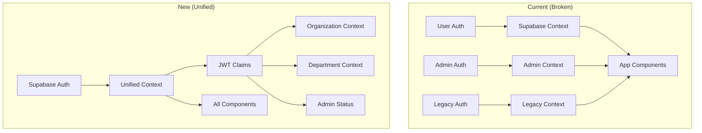

# 🔧 Fix: Unified Supabase Authentication System

## Overview

Complete migration from the current dual authentication system (Supabase Auth + Admin Auth) to a single, unified Supabase Auth system with proper multi-tenant support, admin privileges, and organization context.

## Problem Statement

The Civic Notices platform currently has **three conflicting authentication systems**:
1. Supabase Auth (intended primary)
2. Custom Admin Auth (added recently)
3. Legacy auth remnants

This causes:
- Unreliable logins ("fickle" authentication)
- Broken organization context
- Orphaned registrations
- Incorrect notice-organization relationships
- Session management conflicts

## Proposed Solution

Implement a **single Supabase Auth system** with:
- JWT custom claims for organization/department context
- Unified auth context with admin capabilities
- Proper RLS policies for multi-tenant isolation
- Dynamic council dropdown from database
- Fixed registration → login → dashboard flow

## Technical Approach

### Architecture



### Implementation Phases

#### Phase 1: Database & Auth Infrastructure (Day 1-2)

**Tasks:**
1. Create unified auth schema migration
2. Add Custom Access Token Hook for JWT claims
3. Migrate admin users to unified system
4. Update RLS policies for multi-tenant isolation

**Files to create:**
- `supabase/migrations/20260122000001_unified_auth_setup.sql`
- `supabase/migrations/20260122000002_custom_jwt_claims.sql`
- `supabase/migrations/20260122000003_migrate_admin_users.sql`
- `supabase/migrations/20260122000004_unified_rls_policies.sql`

**Implementation:**

```sql
-- 20260122000001_unified_auth_setup.sql

-- Add admin fields to user metadata (requires dashboard/service role)
-- This will be added via Supabase dashboard as it modifies auth schema

-- Platform admin settings (replaces admin_users)
CREATE TABLE IF NOT EXISTS public.platform_admin_settings (
  user_id UUID PRIMARY KEY REFERENCES auth.users(id) ON DELETE CASCADE,
  admin_role TEXT CHECK (admin_role IN ('super_admin', 'admin', 'support')),
  two_factor_enabled BOOLEAN NOT NULL DEFAULT false,
  two_factor_secret TEXT,
  backup_codes TEXT[],
  ip_allowlist INET[],
  require_ip_allowlist BOOLEAN DEFAULT false,
  session_timeout_minutes INTEGER DEFAULT 120,
  failed_login_attempts INTEGER DEFAULT 0,
  locked_until TIMESTAMPTZ,
  last_admin_action_at TIMESTAMPTZ,
  created_at TIMESTAMPTZ NOT NULL DEFAULT NOW(),
  updated_at TIMESTAMPTZ NOT NULL DEFAULT NOW()
);

-- Indexes for performance
CREATE INDEX idx_platform_admin_user ON platform_admin_settings(user_id);

-- Helper functions with security definer
CREATE OR REPLACE FUNCTION private.get_user_org_id()
RETURNS UUID
LANGUAGE SQL
SECURITY DEFINER
SET search_path = ''
AS $$
  SELECT organization_id
  FROM public.organization_memberships
  WHERE user_id = auth.uid()
  LIMIT 1;
$$;

CREATE OR REPLACE FUNCTION private.get_user_dept_id()
RETURNS UUID
LANGUAGE SQL
SECURITY DEFINER
SET search_path = ''
AS $$
  SELECT department_id
  FROM public.department_memberships
  WHERE user_id = auth.uid()
  ORDER BY last_accessed_at DESC NULLS LAST
  LIMIT 1;
$$;

CREATE OR REPLACE FUNCTION private.is_platform_admin()
RETURNS BOOLEAN
LANGUAGE SQL
SECURITY DEFINER
SET search_path = ''
AS $$
  SELECT EXISTS(
    SELECT 1 FROM public.platform_admin_settings
    WHERE user_id = auth.uid()
  );
$$;

CREATE OR REPLACE FUNCTION private.get_admin_role()
RETURNS TEXT
LANGUAGE SQL
SECURITY DEFINER
SET search_path = ''
AS $$
  SELECT admin_role
  FROM public.platform_admin_settings
  WHERE user_id = auth.uid();
$$;
```

```sql
-- 20260122000002_custom_jwt_claims.sql

-- Custom Access Token Hook for JWT claims
CREATE OR REPLACE FUNCTION public.custom_access_token_hook(event jsonb)
RETURNS jsonb
LANGUAGE plpgsql
SECURITY DEFINER
SET search_path = 'public'
AS $$
DECLARE
  claims jsonb;
  user_org_id uuid;
  user_dept_id uuid;
  user_role text;
  is_admin boolean;
  admin_role_val text;
  org_type text;
BEGIN
  -- Get organization membership
  SELECT om.organization_id, om.role, o.type
  INTO user_org_id, user_role, org_type
  FROM organization_memberships om
  JOIN organizations o ON o.id = om.organization_id
  WHERE om.user_id = (event->>'user_id')::uuid
  ORDER BY om.created_at DESC
  LIMIT 1;

  -- Get current department (for councils)
  IF org_type = 'council' THEN
    SELECT dm.department_id
    INTO user_dept_id
    FROM department_memberships dm
    WHERE dm.user_id = (event->>'user_id')::uuid
    ORDER BY dm.last_accessed_at DESC NULLS LAST
    LIMIT 1;
  END IF;

  -- Check platform admin status
  SELECT
    CASE WHEN pas.user_id IS NOT NULL THEN true ELSE false END,
    pas.admin_role
  INTO is_admin, admin_role_val
  FROM platform_admin_settings pas
  WHERE pas.user_id = (event->>'user_id')::uuid;

  -- Build custom claims
  claims := event -> 'claims';

  -- Add app_metadata with org context
  claims := jsonb_set(claims, '{app_metadata}',
    COALESCE(claims->'app_metadata', '{}'::jsonb) ||
    jsonb_build_object(
      'organization_id', user_org_id,
      'organization_type', org_type,
      'department_id', user_dept_id,
      'role', COALESCE(user_role, 'viewer'),
      'is_platform_admin', COALESCE(is_admin, false),
      'admin_role', admin_role_val
    )
  );

  -- Return modified event
  RETURN jsonb_set(event, '{claims}', claims);
END;
$$;

-- Grant permissions
GRANT USAGE ON SCHEMA public TO supabase_auth_admin;
GRANT EXECUTE ON FUNCTION public.custom_access_token_hook TO supabase_auth_admin;
GRANT SELECT ON public.organizations TO supabase_auth_admin;
GRANT SELECT ON public.organization_memberships TO supabase_auth_admin;
GRANT SELECT ON public.department_memberships TO supabase_auth_admin;
GRANT SELECT ON public.platform_admin_settings TO supabase_auth_admin;
```

#### Phase 2: Frontend Auth Migration (Day 3-4)

**Tasks:**
1. Create unified auth context
2. Remove admin auth context
3. Update all auth hooks usage
4. Fix protected routes
5. Add organization context provider

**Files to modify:**
- `src/contexts/UnifiedAuthContext.tsx` (create new)
- `src/contexts/AuthContext.tsx` (remove)
- `src/contexts/AdminAuthContext.tsx` (remove)
- `src/contexts/OrganizationContext.tsx` (create new)

**Implementation:**

```typescript
// src/contexts/UnifiedAuthContext.tsx
import { createContext, useContext, useEffect, useState, ReactNode } from 'react';
import { User, Session } from '@supabase/supabase-js';
import { supabase } from '@/lib/supabase';
import type { Organization, Department } from '@/types';

interface UnifiedAuthContextType {
  // Core auth
  user: User | null;
  session: Session | null;
  loading: boolean;

  // Organization context
  organization: Organization | null;
  department: Department | null;
  organizations: Organization[];
  departments: Department[];

  // User metadata
  role: string | null;
  isPlatformAdmin: boolean;
  adminRole: 'super_admin' | 'admin' | 'support' | null;

  // Actions
  signIn: (email: string, password: string) => Promise<void>;
  signOut: () => Promise<void>;
  switchOrganization: (orgId: string) => Promise<void>;
  switchDepartment: (deptId: string) => Promise<void>;
  refreshSession: () => Promise<void>;

  // Permissions
  hasPermission: (permission: string) => boolean;
  canAccessAdmin: () => boolean;
}

const UnifiedAuthContext = createContext<UnifiedAuthContextType | undefined>(undefined);

export function UnifiedAuthProvider({ children }: { children: ReactNode }) {
  const [user, setUser] = useState<User | null>(null);
  const [session, setSession] = useState<Session | null>(null);
  const [loading, setLoading] = useState(true);
  const [organization, setOrganization] = useState<Organization | null>(null);
  const [department, setDepartment] = useState<Department | null>(null);
  const [organizations, setOrganizations] = useState<Organization[]>([]);
  const [departments, setDepartments] = useState<Department[]>([]);

  // Extract metadata from session
  const appMetadata = session?.user?.app_metadata || {};
  const isPlatformAdmin = appMetadata.is_platform_admin || false;
  const adminRole = appMetadata.admin_role || null;
  const role = appMetadata.role || 'viewer';

  useEffect(() => {
    // Get initial session
    supabase.auth.getSession().then(({ data: { session } }) => {
      setSession(session);
      setUser(session?.user ?? null);
      if (session) {
        loadUserContext(session.user);
      }
      setLoading(false);
    });

    // Listen for auth changes
    const { data: { subscription } } = supabase.auth.onAuthStateChange(
      async (_event, session) => {
        setSession(session);
        setUser(session?.user ?? null);
        if (session) {
          await loadUserContext(session.user);
        } else {
          clearContext();
        }
      }
    );

    return () => subscription.unsubscribe();
  }, []);

  const loadUserContext = async (user: User) => {
    const metadata = user.app_metadata || {};

    // Load organization
    if (metadata.organization_id) {
      const { data: org } = await supabase
        .from('organizations')
        .select('*')
        .eq('id', metadata.organization_id)
        .single();
      setOrganization(org);

      // Load departments for councils
      if (org?.type === 'council') {
        const { data: depts } = await supabase
          .from('departments')
          .select('*')
          .eq('organization_id', org.id);
        setDepartments(depts || []);

        // Set current department
        if (metadata.department_id) {
          const currentDept = depts?.find(d => d.id === metadata.department_id);
          setDepartment(currentDept || null);
        }
      }
    }

    // Load all user organizations
    const { data: userOrgs } = await supabase
      .from('organization_memberships')
      .select('organization:organizations(*)')
      .eq('user_id', user.id);

    if (userOrgs) {
      setOrganizations(userOrgs.map(om => om.organization).filter(Boolean));
    }
  };

  const clearContext = () => {
    setOrganization(null);
    setDepartment(null);
    setOrganizations([]);
    setDepartments([]);
  };

  const signIn = async (email: string, password: string) => {
    const { error } = await supabase.auth.signInWithPassword({
      email,
      password,
    });
    if (error) throw error;
  };

  const signOut = async () => {
    await supabase.auth.signOut();
    clearContext();
  };

  const switchOrganization = async (orgId: string) => {
    // Update user metadata
    await supabase.auth.updateUser({
      data: { current_organization_id: orgId }
    });

    // Reload context
    if (user) {
      await loadUserContext(user);
    }
  };

  const switchDepartment = async (deptId: string) => {
    // Update last accessed
    await supabase
      .from('department_memberships')
      .update({ last_accessed_at: new Date().toISOString() })
      .eq('user_id', user?.id)
      .eq('department_id', deptId);

    // Update local state
    const newDept = departments.find(d => d.id === deptId);
    if (newDept) {
      setDepartment(newDept);
    }
  };

  const refreshSession = async () => {
    const { data: { session } } = await supabase.auth.refreshSession();
    setSession(session);
  };

  const hasPermission = (permission: string): boolean => {
    // Platform admins have all permissions
    if (isPlatformAdmin) return true;

    // TODO: Implement permission checking based on role
    return false;
  };

  const canAccessAdmin = (): boolean => {
    return isPlatformAdmin;
  };

  const value = {
    user,
    session,
    loading,
    organization,
    department,
    organizations,
    departments,
    role,
    isPlatformAdmin,
    adminRole,
    signIn,
    signOut,
    switchOrganization,
    switchDepartment,
    refreshSession,
    hasPermission,
    canAccessAdmin,
  };

  return (
    <UnifiedAuthContext.Provider value={value}>
      {children}
    </UnifiedAuthContext.Provider>
  );
}

export function useAuth() {
  const context = useContext(UnifiedAuthContext);
  if (context === undefined) {
    throw new Error('useAuth must be used within UnifiedAuthProvider');
  }
  return context;
}
```

#### Phase 3: Fix Multi-Tenant Data Model (Day 5-6)

**Tasks:**
1. Make organization_id required on notices
2. Replace static council dropdown
3. Fix notice upload to use organization context
4. Update RLS policies

**Files to modify:**
- `supabase/migrations/20260123000001_fix_notices_relationships.sql`
- `src/components/CouncilSelect.tsx`
- `src/components/DynamicCouncilSelect.tsx` (create new)

**Implementation:**

```sql
-- 20260123000001_fix_notices_relationships.sql

-- First, update any NULL organization_ids (temporary fix)
UPDATE public.notices
SET organization_id = (
  SELECT id FROM organizations
  WHERE type = 'council'
  LIMIT 1
)
WHERE organization_id IS NULL;

-- Make organization_id required
ALTER TABLE public.notices
  ALTER COLUMN organization_id SET NOT NULL;

-- Add proper foreign key constraint if missing
DO $$
BEGIN
  IF NOT EXISTS (
    SELECT 1 FROM pg_constraint
    WHERE conname = 'notices_organization_id_fkey'
  ) THEN
    ALTER TABLE public.notices
      ADD CONSTRAINT notices_organization_id_fkey
      FOREIGN KEY (organization_id)
      REFERENCES public.organizations(id) ON DELETE CASCADE;
  END IF;
END $$;

-- Create view for active councils (replaces JSON file)
CREATE OR REPLACE VIEW public.active_councils AS
SELECT
  o.id,
  o.name,
  o.slug,
  cs.authority_email as email,
  cs.authority_address as address,
  cs.authority_phone as phone,
  o.created_at
FROM organizations o
LEFT JOIN council_settings cs ON cs.organization_id = o.id
WHERE o.type = 'council'
  AND o.status = 'active'
ORDER BY o.name;

-- Grant read access to authenticated users
GRANT SELECT ON public.active_councils TO authenticated;

-- Update RLS policies
DROP POLICY IF EXISTS "Public read access" ON public.notices;
DROP POLICY IF EXISTS "Authenticated insert" ON public.notices;
DROP POLICY IF EXISTS "Authenticated update" ON public.notices;

-- New unified RLS policies
CREATE POLICY "Platform admins full access"
ON public.notices
FOR ALL
TO authenticated
USING ((SELECT private.is_platform_admin()));

CREATE POLICY "Organization members see own notices"
ON public.notices
FOR SELECT
TO authenticated
USING (
  organization_id IN (
    SELECT organization_id
    FROM organization_memberships
    WHERE user_id = auth.uid()
  )
);

CREATE POLICY "Department members manage notices"
ON public.notices
FOR ALL
TO authenticated
USING (
  department_id IN (
    SELECT department_id
    FROM department_memberships
    WHERE user_id = auth.uid()
      AND role IN ('department_admin', 'editor')
  )
);
```

```typescript
// src/components/DynamicCouncilSelect.tsx
import { useEffect, useState } from 'react';
import { supabase } from '@/lib/supabase';
import { useAuth } from '@/contexts/UnifiedAuthContext';

interface Council {
  id: string;
  name: string;
  email: string;
  address: string;
}

export default function DynamicCouncilSelect({
  value,
  onChange,
  disabled = false
}: {
  value?: string;
  onChange: (council: Council | null) => void;
  disabled?: boolean;
}) {
  const { organization, isPlatformAdmin } = useAuth();
  const [councils, setCouncils] = useState<Council[]>([]);
  const [loading, setLoading] = useState(true);

  useEffect(() => {
    loadCouncils();
  }, []);

  const loadCouncils = async () => {
    // If user is from a council, auto-select their council
    if (organization?.type === 'council' && !isPlatformAdmin) {
      setCouncils([{
        id: organization.id,
        name: organization.name,
        email: organization.settings?.authority_email || '',
        address: organization.settings?.authority_address || ''
      }]);
      onChange(councils[0]);
    } else {
      // Load all councils for admins or firms
      const { data, error } = await supabase
        .from('active_councils')
        .select('*')
        .order('name');

      if (data) {
        setCouncils(data);
      }
    }
    setLoading(false);
  };

  if (loading) {
    return <div>Loading councils...</div>;
  }

  // If only one council (user's own), show as read-only
  if (councils.length === 1 && !isPlatformAdmin) {
    return (
      <div className="p-3 bg-gray-50 rounded-lg">
        <div className="text-sm text-gray-600">Council</div>
        <div className="font-medium">{councils[0].name}</div>
      </div>
    );
  }

  return (
    <select
      value={value}
      onChange={(e) => {
        const council = councils.find(c => c.id === e.target.value);
        onChange(council || null);
      }}
      disabled={disabled || councils.length <= 1}
      className="w-full px-3 py-2 border border-gray-300 rounded-lg focus:ring-2 focus:ring-blue-500"
    >
      <option value="">Select a council...</option>
      {councils.map(council => (
        <option key={council.id} value={council.id}>
          {council.name}
        </option>
      ))}
    </select>
  );
}
```

#### Phase 4: Backend Migration (Day 7-8)

**Tasks:**
1. Update auth middleware
2. Remove admin-specific auth routes
3. Update API endpoints to use unified auth
4. Add audit logging

**Files to modify:**
- `server/middleware/unifiedAuth.ts` (create new)
- `server/middleware/auth.ts` (remove)
- `server/middleware/adminAuth.ts` (remove)
- `server/routes/admin/auth.ts` (remove most endpoints)

**Implementation:**

```typescript
// server/middleware/unifiedAuth.ts
import { Request, Response, NextFunction } from 'express';
import { getServiceSupabaseClient } from '../lib/supabase';

interface AuthRequest extends Request {
  user?: {
    id: string;
    email: string;
    organizationId?: string;
    departmentId?: string;
    role?: string;
    isPlatformAdmin?: boolean;
    adminRole?: string;
  };
}

export const requireAuth = async (
  req: AuthRequest,
  res: Response,
  next: NextFunction
) => {
  try {
    const token = req.headers.authorization?.replace('Bearer ', '');

    if (!token) {
      return res.status(401).json({ error: 'No authorization token provided' });
    }

    const supabase = getServiceSupabaseClient();
    const { data: { user }, error } = await supabase.auth.getUser(token);

    if (error || !user) {
      return res.status(401).json({ error: 'Invalid or expired token' });
    }

    // Extract metadata
    const appMetadata = user.app_metadata || {};

    req.user = {
      id: user.id,
      email: user.email!,
      organizationId: appMetadata.organization_id,
      departmentId: appMetadata.department_id,
      role: appMetadata.role,
      isPlatformAdmin: appMetadata.is_platform_admin || false,
      adminRole: appMetadata.admin_role
    };

    next();
  } catch (error) {
    console.error('Auth middleware error:', error);
    res.status(500).json({ error: 'Authentication error' });
  }
};

export const requirePlatformAdmin = async (
  req: AuthRequest,
  res: Response,
  next: NextFunction
) => {
  if (!req.user?.isPlatformAdmin) {
    return res.status(403).json({ error: 'Platform admin access required' });
  }
  next();
};

export const requireOrganizationMember = async (
  req: AuthRequest,
  res: Response,
  next: NextFunction
) => {
  const orgId = req.params.orgId || req.query.orgId;

  if (!orgId || req.user?.organizationId !== orgId) {
    return res.status(403).json({ error: 'Not a member of this organization' });
  }

  next();
};

// Audit logging middleware
export const auditLog = (action: string, resourceType: string) => {
  return async (req: AuthRequest, res: Response, next: NextFunction) => {
    const originalSend = res.json;

    res.json = function(data: any) {
      // Log the action
      const supabase = getServiceSupabaseClient();
      supabase.rpc('log_audit_event', {
        p_action: action,
        p_resource_type: resourceType,
        p_resource_id: req.params.id || data?.id,
        p_metadata: {
          method: req.method,
          path: req.path,
          user_id: req.user?.id,
          ip: req.ip
        }
      }).then(() => {
        console.log(`Audit: ${action} on ${resourceType}`);
      });

      return originalSend.call(this, data);
    };

    next();
  };
};
```

#### Phase 5: Testing & Cleanup (Day 9-10)

**Tasks:**
1. Create comprehensive test suite
2. Test all auth flows
3. Remove deprecated code
4. Update documentation

**Test scenarios:**
- Council registration → auto-login → dashboard access
- Firm registration → auto-login → dashboard access
- Platform admin login → admin panel access
- Notice creation with proper organization linking
- Department switching
- RLS policy enforcement

## Alternative Approaches Considered

1. **Keep dual auth system** - Rejected: Too complex, causes conflicts
2. **Custom JWT implementation** - Rejected: Supabase Auth is more secure
3. **Separate admin app** - Rejected: Increases maintenance burden

## Acceptance Criteria

### Functional Requirements

- [ ] Single sign-in for all user types
- [ ] Platform admins can access admin panel
- [ ] Organizations/departments properly linked
- [ ] Councils loaded from database, not JSON
- [ ] Notice creation links to user's organization
- [ ] Session persistence works correctly
- [ ] 2FA works for admin users

### Non-Functional Requirements

- [ ] Auth response time < 200ms
- [ ] Session refresh seamless to users
- [ ] No unauthorized data access possible
- [ ] Audit trail for all admin actions

### Quality Gates

- [ ] All auth tests passing
- [ ] RLS policies tested with different roles
- [ ] No console errors during auth flows
- [ ] Migration rollback plan tested

## Additional Improvements Suggested

### 1. Email Verification Flow
Currently missing proper email verification. Add:
```typescript
// After registration
await supabase.auth.signUp({
  email,
  password,
  options: {
    emailRedirectTo: `${window.location.origin}/auth/callback`
  }
});
```

### 2. Password Reset Flow
Add forgot password functionality:
```typescript
await supabase.auth.resetPasswordForEmail(email, {
  redirectTo: `${window.location.origin}/auth/reset-password`,
});
```

### 3. Social Auth Integration
Add Google/Microsoft OAuth for easier onboarding:
```typescript
await supabase.auth.signInWithOAuth({
  provider: 'google',
  options: {
    redirectTo: `${window.location.origin}/auth/callback`
  }
});
```

### 4. Session Activity Monitoring
Track user activity for security:
```typescript
class ActivityMonitor {
  private lastActivity = Date.now();
  private readonly TIMEOUT = 30 * 60 * 1000; // 30 min

  constructor() {
    this.setupListeners();
    this.checkActivity();
  }

  private setupListeners() {
    ['mousedown', 'keydown', 'scroll'].forEach(event => {
      document.addEventListener(event, () => {
        this.lastActivity = Date.now();
      });
    });
  }

  private checkActivity() {
    setInterval(() => {
      if (Date.now() - this.lastActivity > this.TIMEOUT) {
        supabase.auth.signOut();
      }
    }, 60000); // Check every minute
  }
}
```

### 5. Improved Error Messages
Replace generic auth errors with user-friendly messages:
```typescript
const AUTH_ERROR_MESSAGES: Record<string, string> = {
  'Invalid login credentials': 'Email or password is incorrect',
  'User not found': 'No account exists with this email',
  'Email not confirmed': 'Please verify your email before logging in',
  'User already registered': 'An account already exists with this email'
};
```

### 6. Performance Optimizations

**Add indexes for auth queries:**
```sql
CREATE INDEX idx_org_memberships_user ON organization_memberships(user_id);
CREATE INDEX idx_dept_memberships_user ON department_memberships(user_id);
CREATE INDEX idx_notices_org ON notices(organization_id);
CREATE INDEX idx_notices_dept ON notices(department_id);
```

**Cache organization context:**
```typescript
// Use React Query or SWR
const { data: orgContext } = useSWR(
  user ? `/api/users/${user.id}/context` : null,
  fetcher,
  {
    revalidateOnFocus: false,
    dedupingInterval: 60000 // 1 minute
  }
);
```

### 7. Better Demo Mode
Instead of hardcoded demo accounts, use feature flag:
```typescript
const DEMO_MODE = import.meta.env.VITE_DEMO_MODE === 'true';

if (DEMO_MODE) {
  // Skip certain validations
  // Use mock data
  // Show demo banner
}
```

## Migration Rollback Plan

If issues occur:

1. **Immediate rollback (< 1 hour):**
   - Re-enable admin auth routes
   - Switch back to dual context providers
   - Restore admin_sessions table

2. **Gradual rollback (1-24 hours):**
   - Use feature flag to route % of traffic
   - Monitor error rates
   - Fix issues before continuing

3. **Data recovery:**
   - All migrations are reversible
   - Backup admin_users before migration
   - Keep audit log of all changes

## Success Metrics

- Login success rate > 99.5%
- Session validation latency < 100ms
- Zero unauthorized access incidents
- 95% reduction in auth-related support tickets
- All councils can successfully upload notices

## Dependencies & Risks

**Dependencies:**
- Supabase Auth Custom Hooks (Beta feature)
- All admin users have auth.users records
- Organizations table properly populated

**Risks:**
- Custom JWT claims may hit size limits
- MFA migration complexity for existing admins
- RLS policy performance impact

**Mitigations:**
- Keep JWT claims minimal
- Optional MFA during transition
- Index all columns used in RLS policies

## Timeline

| Day | Tasks | Deliverables |
|-----|-------|--------------|
| 1-2 | Database & Auth Infrastructure | Migration scripts, JWT hooks |
| 3-4 | Frontend Auth Migration | Unified context, updated components |
| 5-6 | Fix Multi-Tenant Model | Dynamic dropdowns, RLS policies |
| 7-8 | Backend Migration | Unified middleware, audit logging |
| 9-10 | Testing & Cleanup | Test suite, removed legacy code |

**Total Duration:** 10 days (2 weeks with buffer)

## Documentation Updates Required

- [ ] Update auth flow diagrams
- [ ] Document new context API
- [ ] Update deployment guide
- [ ] Create troubleshooting guide
- [ ] Update API documentation

## References

- [Supabase Custom JWT Claims](https://supabase.com/docs/guides/auth/auth-hooks/custom-access-token-hook)
- [Row Level Security Best Practices](https://supabase.com/docs/guides/database/postgres/row-level-security)
- [Multi-tenant Architecture](https://supabase.com/docs/guides/resources/examples/multi-tenant)
- Current analysis: `/docs/AUTHENTICATION_ARCHITECTURE_ANALYSIS.md`